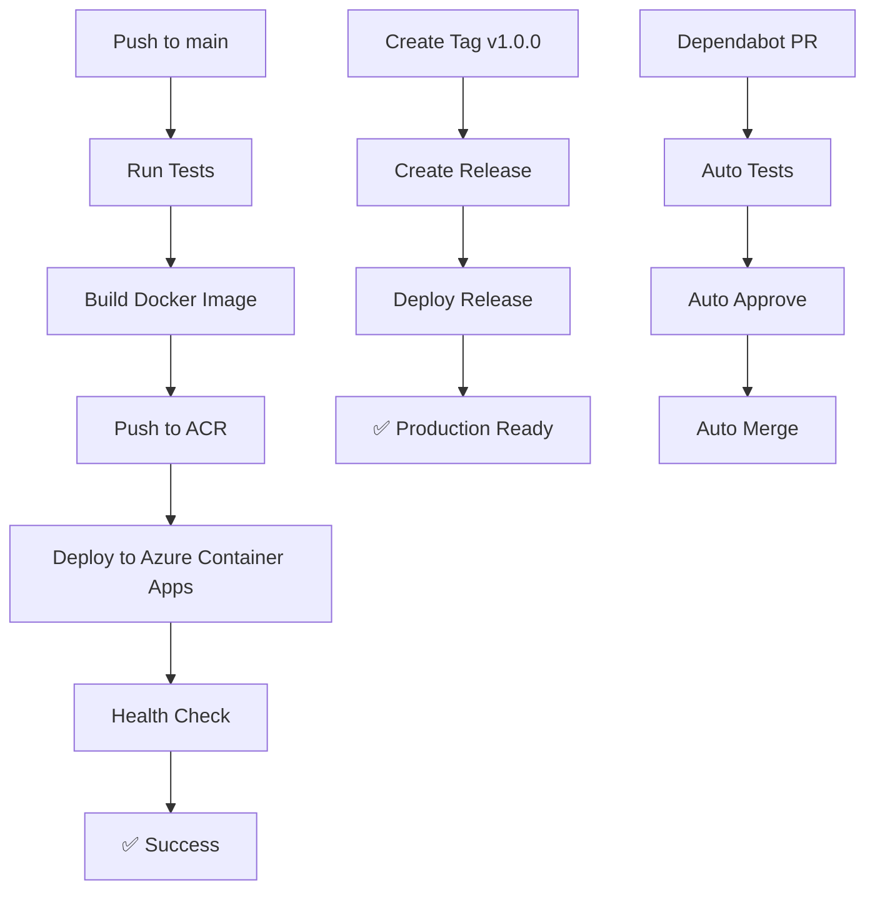

# 🤖 Resumen de Integración con GitHub Actions

## ✅ Archivos Creados/Modificados

### 📁 Workflows de GitHub Actions

- `.github/workflows/deploy.yml` - Despliegue automático a Azure Container Apps
- `.github/workflows/ci.yml` - CI/CD con tests y validaciones
- `.github/workflows/release.yml` - Manejo de releases con tags
- `.github/workflows/dependabot.yml` - Auto-merge de dependencias

### 📁 Configuración

- `.github/dependabot.yml` - Configuración de Dependabot
- `.github/README.md` - Documentación de GitHub Actions
- `sonar-project.properties` - Configuración de SonarCloud

### 📁 Scripts de Configuración

- `setup-github-actions.sh` - Setup automático (Bash)
- `Setup-GitHubActions.ps1` - Setup automático (PowerShell)

### 📁 Actualizaciones

- `package.json` - Nuevos scripts para CI/CD
- `DEPLOYMENT.md` - Documentación actualizada
- `.gitignore` - Patrones adicionales

## 🚀 Funcionalidades Implementadas

### 1. **Despliegue Automático**

- ✅ Push a `main` → Despliegue automático
- ✅ Build de Docker optimizado
- ✅ Push a Azure Container Registry
- ✅ Despliegue a Azure Container Apps
- ✅ Health checks automáticos

### 2. **CI/CD Completo**

- ✅ Tests en múltiples versiones de Node.js
- ✅ Linting y formateo de código
- ✅ Análisis de seguridad con Snyk
- ✅ Análisis de calidad con SonarCloud
- ✅ Tests de construcción Docker

### 3. **Gestión de Releases**

- ✅ Release automático con tags
- ✅ Changelog generado automáticamente
- ✅ Despliegue de versiones específicas
- ✅ Versionado semántico

### 4. **Mantenimiento Automático**

- ✅ Dependabot para actualizar dependencias
- ✅ Auto-merge de PRs de dependencias
- ✅ Actualización de npm, GitHub Actions y Docker

## 📋 Pasos para Activar

### 1. **Configurar Azure Service Principal**

```bash
# Ejecutar script de configuración
.\Setup-GitHubActions.ps1
```

### 2. **Configurar Secrets en GitHub**

Ve a tu repositorio → Settings → Secrets and variables → Actions:

**Obligatorios:**

- `AZURE_CREDENTIALS` - Credenciales de Azure
- `MYSQL_PASSWORD` - Password de MySQL

**Opcionales:**

- `MYSQL_HOST`, `MYSQL_USER`, `MYSQL_DATABASE`
- `SNYK_TOKEN`, `SONAR_TOKEN`

### 3. **Hacer Push**

```bash
git add .
git commit -m "🤖 Setup GitHub Actions for Azure Container Apps"
git push origin main
```

¡El despliegue se ejecutará automáticamente!

## 🔄 Flujo de Trabajo



## 📊 Monitoring y Logs

### GitHub Actions

- Ve a tu repositorio → Actions
- Selecciona el workflow específico
- Revisa logs detallados

### Azure Container Apps

```bash
# Ver logs de la aplicación
az containerapp logs show \
  --name backend-inventory-app \
  --resource-group rg-inventory-backend \
  --follow
```

### URLs de la aplicación

- **API**: `https://tu-app.azurecontainerapps.io`
- **Health**: `https://tu-app.azurecontainerapps.io/ping`
- **Docs**: `https://tu-app.azurecontainerapps.io/explorer`

## 🎯 Beneficios Obtenidos

### 🚀 **Despliegue Automático**

- No más despliegues manuales
- Consistencia en cada release
- Rollback automático en caso de fallas

### 🔒 **Seguridad**

- Análisis de vulnerabilidades automático
- Gestión segura de secrets
- Actualizaciones automáticas de dependencias

### 📈 **Calidad de Código**

- Tests automáticos en cada PR
- Análisis de código estático
- Cobertura de código

### ⚡ **Eficiencia**

- Despliegue en minutos
- Feedback inmediato
- Menos tiempo en tareas manuales

## 🛠️ Comandos Útiles

### Despliegue manual

```bash
# Trigger manual del workflow
gh workflow run deploy.yml
```

### Crear release

```bash
git tag v1.0.0
git push origin v1.0.0
```

### Ver status

```bash
gh workflow list
gh run list
```

## 🎉 ¡Listo para usar!

Tu backend ahora tiene un pipeline completo de CI/CD que:

- ✅ Testa automáticamente tu código
- ✅ Despliega a Azure Container Apps
- ✅ Mantiene tus dependencias actualizadas
- ✅ Monitorea la salud de tu aplicación
- ✅ Crea releases automáticamente

¡Solo haz push y deja que GitHub Actions haga el resto! 🚀
